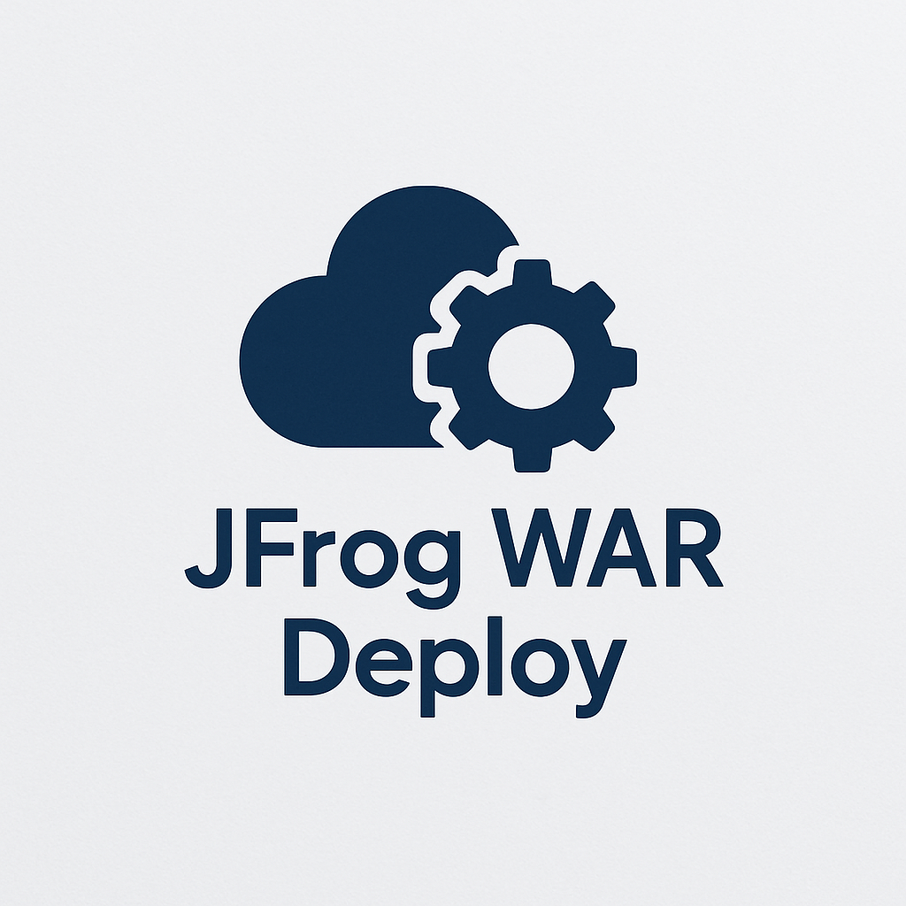
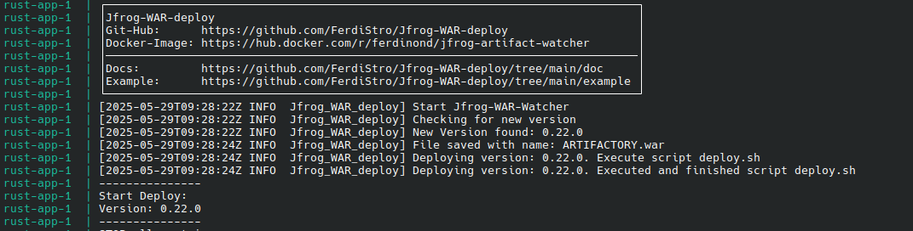

# JFrog WAR Deploy – Artifact Watcher 





This service continuously monitors a specified JFrog Artifactory repository for `.war` file updates. Upon detecting a
new version, it automatically triggers a custom deployment script.


> **Docker Hub:** [ferdinond/jfrog-artifact-watcher](https://hub.docker.com/r/ferdinond/jfrog-artifact-watcher)


---

## 🚀 Features

- Monitors a JFrog repository for updated `.war` artifacts
- Automatically runs a custom deployment script on update
- Lightweight and configurable via environment variables
- Docker-ready for easy integration into CI/CD pipelines

---

## 🔧 Setup Instructions

1. **Download the Docker image**
   ```bash
   docker pull ferdinond/jfrog-artifact-watcher
    ```

2. **Run the container**
   Use `docker` or `docker-compose` to run the watcher.
   See [docker-compose example](https://github.com/FerdiStro/Jfrog-WAR-deploy/blob/main/example/docker-compose.yaml).

3. **Configure environment variables**
   All required settings are provided via environment variables (see below).

4. **Create your deployment script**
   The script (e.g., `deploy.sh`) should contain the actions to perform when a new `.war` is detected.
   Example: [deploy.sh](https://github.com/FerdiStro/Jfrog-WAR-deploy/blob/main/example/deploy/deploy.sh)

5. **Start the Docker container**
   Make sure the `docker.sock` and required files are mounted correctly to allow script execution.

---

## ⚙️ Environment Variables

| Variable      | Default            | Description                                                                                                                                     |
|---------------|--------------------|-------------------------------------------------------------------------------------------------------------------------------------------------|
| `RUST_LOG`    | `info`             | Log level: `error`, `warn`, `info`, `debug`, or `trace`                                                                                         |
| `INTERVAL`    | `5`                | Interval (in seconds) for checking new `.war` versions in the repository                                                                        |
| `JFROG_REPRO` | *(required)*       | Name of your JFrog repository                                                                                                                   |
| `JFROG_HOST`  | `https://jfrog.io` | JFrog base URL, e.g. `https://yourcompany.jfrog.io`                                                                                             |
| `WAR_NAME`    | *(required)*       | Name pattern of your `.war` artifact, e.g. `yourapp-{%VERSION}.war`. The `{%VERSION}` placeholder will be replaced with the actual version tag. |
| `JFROG_AUTH`  | *(required)*       | JFrog authentication string in the format: `USERNAME:TOKEN`                                                                                     |
| `http_proxy`  | *(optional)*       | Set this if you use an HTTP proxy                                                                                                               |
| `https_proxy` | *(optional)*       | Set this if you use an HTTPS proxy                                                                                                              |

---

## 📁 Docker Volume Notes

To allow the deployment script to interact with Docker or files on the host:

* Mount the Docker socket into the container:

  ```yaml
  volumes:
    - /var/run/docker.sock:/var/run/docker.sock
  ```

* Mount any necessary files (like deployment scripts) into the container:

  ```yaml
  volumes:
    - ./deploy:/deploy
  ```

> More info on `deploy.sh` can be
> found [here](https://github.com/FerdiStro/Jfrog-WAR-deploy/blob/main/doc/deploy-shell-sript.md)

---

## ✅ Expected Output

After setup, the service logs should show status checks and deployment triggers like this:



---

## 📄 License

MIT – feel free to use, share, and contribute.

